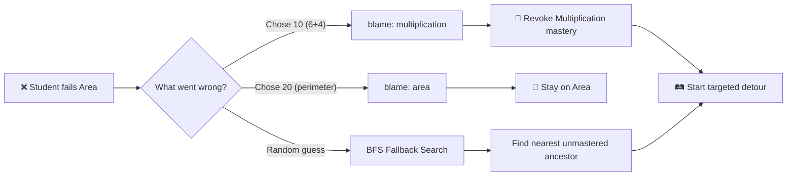
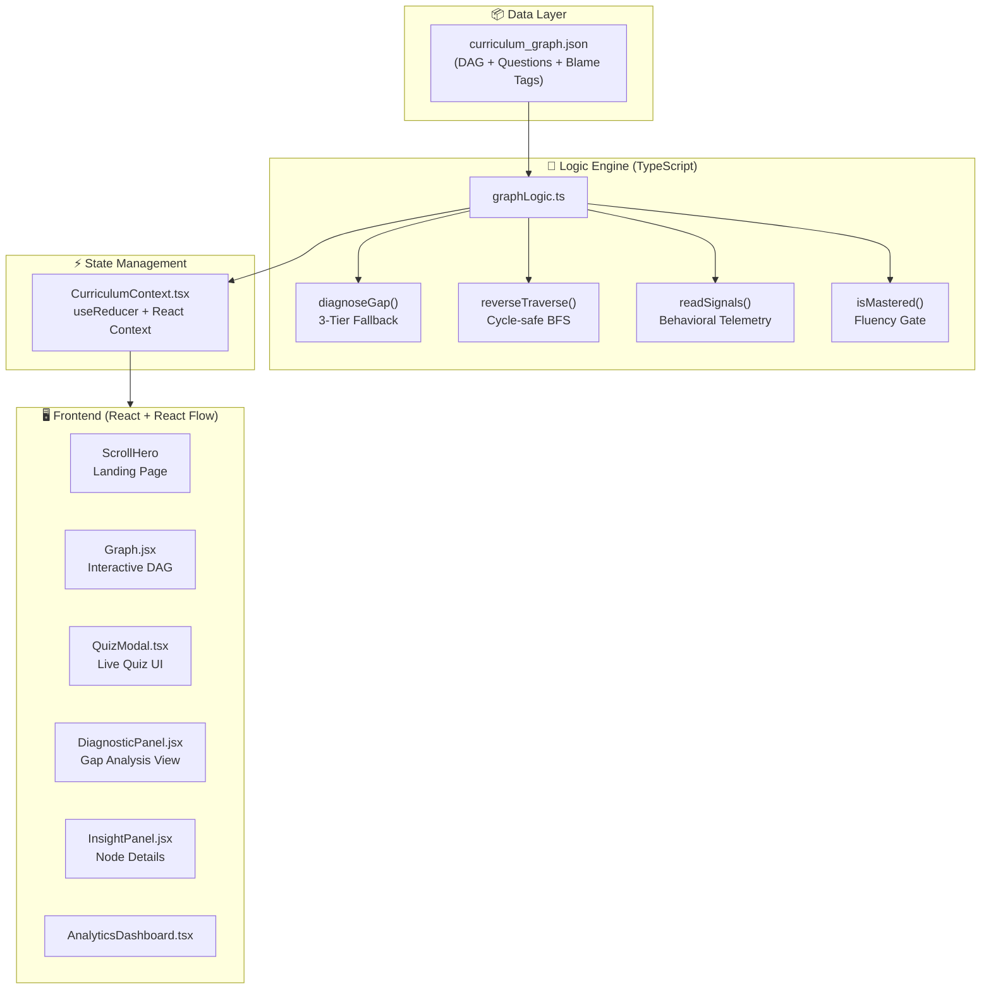

<p align="center">
  
  
  
  
  
</p>

# 🌳 CogniTree

### AI-Powered Adaptive Learning & Knowledge Gap Detection

> *"A GPS for the student's mind — it doesn't just mark answers wrong, it traces every mistake back to its foundational root and dynamically reroutes the learning path."*

---

## 📋 Table of Contents

- [The Problem](#-the-problem)
- [Our Solution](#-our-solution)
- [Core Features](#-core-features)
- [System Architecture](#-system-architecture)
- [Tech Stack](#-tech-stack)
- [Project Structure](#-project-structure)
- [Getting Started](#-getting-started)
- [How It Works](#-how-it-works)
- [Why Deterministic AI?](#-why-deterministic-ai)
- [Future Scope — Where LLMs Fit](#-future-scope--where-llms-fit)
- [Team](#-team)

---

## 🔴 The Problem

Students in the same classroom often have vastly different levels of understanding, learning speeds, and knowledge gaps. Traditional learning systems deliver **identical content to every student** regardless of their individual needs.

A student may score poorly on *Area of Rectangles* — not because they can't learn Area, but because they have an **unidentified prerequisite gap in Multiplication** that was never caught. Similarly, a student who has already mastered a concept continues receiving the same material instead of progressing forward.

> [!IMPORTANT]
> The challenge requires us to build a system that:
> - Identifies strengths and weaknesses
> - Detects knowledge gaps
> - Identifies possible misconceptions
> - Analyses learning patterns
> - Dynamically recommends a personalized learning path

---

## 💡 Our Solution

CogniTree transforms a flat curriculum into a **Directed Acyclic Graph (DAG)** — a visual, interactive knowledge tree where every concept is a node and every prerequisite is an edge.

Instead of treating wrong answers as generic failures, we map **specific wrong answers (distractors) to specific upstream misconceptions** using a `blame` tag system inspired by the [Kaggle Eedi Educational Dataset](https://www.kaggle.com/competitions/eedi-mining-misconceptions-in-student-errors). Our deterministic logic engine then uses **reverse graph traversal** to pinpoint the exact foundational crack and dynamically reroute the student's learning path.



---

## ✨ Core Features

### 1. 🎯 3-Tier Diagnostic Fallback Algorithm

Our headline feature. When a student answers incorrectly, the engine runs a strict priority cascade to determine the **true** root cause:

| Tier | Name | How It Works | When It Fires |
|:----:|:-----|:-------------|:--------------|
| **1** | Explicit Blame | Reads the `blame` tag authored into the wrong answer's JSON data | The distractor maps to a known misconception |
| **2** | Structural Search | Runs a **Breadth-First Search (BFS)** backward through the DAG, stopping at the nearest unmastered ancestor | No blame tag exists; falls back to graph analysis |
| **3** | Self-Blame | Keeps the student on the current topic | All prerequisites are verified as mastered |

> [!TIP]
> We chose **BFS over DFS** because BFS searches layer-by-layer, guaranteeing we find the **closest** foundational gap first. DFS might plunge down a single branch and incorrectly send a Calculus student all the way back to basic Counting.

---

### 2. 📊 Behavioral Telemetry & Fluency Tracking

Getting the right answer is **not enough**. CogniTree measures true cognitive fluency:

```typescript
// readSignals() — The Behavioral Telemetry Engine
struggling: p.wrong >= 2 || (accuracy < 0.5 && p.attempts >= 2)
excelling:  p.wrong === 0 && accuracy === 1 && secondsPerAttempt < 20
```

```typescript
// isMastered() — The Fluency Gate
if (signals.struggling || signals.secondsPerAttempt > 45) {
  return false; // Mastery DENIED — student is calculating, not recalling
}
```

> If a student scores 100% but takes 45+ seconds per question, the engine **blocks mastery** because slow correct answers indicate calculation, not fluency.

---

### 3. 🔄 Dynamic Mastery Revocation

CogniTree accounts for the **cognitive forgetting curve**. If a higher-level failure exposes a foundational crack:

1. The engine traces the failure backward to the prerequisite
2. **Revokes** the historical mastery of that prerequisite (green → red)
3. **Locks** all downstream nodes that depended on it
4. Forces a targeted **detour** to repair the foundation before resuming

---

## 🏗 System Architecture



---

## 🛠 Tech Stack

| Layer | Technology | Purpose |
|:------|:-----------|:--------|
| **Frontend** | React 19 + Vite 8 | Component-based UI with hot module replacement |
| **Graph Visualization** | React Flow (`@xyflow/react`) | Interactive, pannable DAG rendering |
| **Styling** | Tailwind CSS 4 | Utility-first responsive design with dark/light themes |
| **Core Logic** | TypeScript 7 | Type-safe, isomorphic AI engine (runs in browser, zero API latency) |
| **Icons** | Lucide React | Consistent icon system |
| **Data** | JSON DAG | Authored curriculum graph with misconception-mapped distractors |

---

## 📁 Project Structure

```
nodedesign/
├── src/
│   ├── core/                          # 🧠 The AI Brain
│   │   ├── curriculum_graph.json      #    DAG database (nodes, questions, blame tags)
│   │   ├── graphLogic.ts              #    Pure functions: BFS, diagnoseGap, readSignals
│   │   └── CurriculumContext.tsx      #    React state manager (useReducer)
│   │
│   ├── components/
│   │   ├── graph/                     # 📊 Interactive graph (React Flow)
│   │   │   └── Graph.jsx
│   │   ├── panels/                    # 📋 Side panels
│   │   │   ├── DiagnosticPanel.jsx    #    Gap analysis & detour recommendation
│   │   │   ├── InsightPanel.jsx       #    Node details & stats
│   │   │   └── CurriculumNav.jsx      #    Left sidebar navigation
│   │   ├── hero/                      # 🏠 Landing page
│   │   │   └── ScrollHero.jsx
│   │   ├── auth/                      # 🔐 Authentication
│   │   │   └── LoginModal.jsx
│   │   ├── ui/                        # 🎨 Shared UI components
│   │   │   └── TopBar.jsx
│   │   ├── QuizModal.tsx              # 📝 Live quiz interface
│   │   └── AnalyticsDashboard.tsx     # 📈 Student analytics overlay
│   │
│   ├── hooks/
│   │   └── useDiagnosticScan.js       # 🔴 Red tracer animation controller
│   │
│   ├── App.jsx                        # 🔗 Root component (wires everything together)
│   └── main.jsx                       # ⚡ Entry point (wraps app in CurriculumProvider)
│
├── package.json
└── vite.config.js
```

---

## 🚀 Getting Started

### Prerequisites
- **Node.js** ≥ 18
- **npm** ≥ 9

### Installation & Run

```bash
# Clone the repository
git clone https://github.com/Mah-bin/hackathon.git
cd hackathon/nodedesign

# Install dependencies
npm install

# Start development server
npm run dev
```

The app will open at `http://localhost:5173`

---

## 🎮 How It Works

### Demo Walkthrough

1. **Land on the Hero Page** → Click "Explore" to enter the knowledge graph
2. **View the DAG** → Green nodes are mastered, blue nodes are available, grey nodes are locked
3. **Click a node** → The Insight Panel opens with details and a "Start Quiz" button
4. **Take the Quiz** → Answer the multiple-choice questions
5. **Get it wrong** → The engine instantly runs `diagnoseGap()`:
   - If a `blame` tag exists → direct routing to the blamed prerequisite
   - If no tag → BFS backward search for the nearest weak foundation
   - If all foundations are solid → stay on current topic
6. **Watch the animation** → A red tracer line animates backward through the graph, visually showing the diagnostic path
7. **See the Diagnostic Panel** → Shows the detected gap, evidence breakdown, and recommended action
8. **Click "Start Detour"** → The UI focuses on the gap node for targeted remediation
9. **Master the gap** → Answer correctly and quickly → mastery is restored → original path unlocks again

---

## 🤖 Why Deterministic AI?

> [!CAUTION]
> In education, **hallucinating a curriculum path can severely damage a student's learning trajectory.** A probabilistic LLM might say the gap is "Multiplication" 8 out of 10 times, but on the 9th time, it might hallucinate "Spelling" or "Physics."

| | Deterministic AI (CogniTree) | LLM-Based Router |
|:--|:--|:--|
| **Consistency** | Same input → same diagnosis, 100% of the time | Same input → different outputs each time |
| **Latency** | Runs in-browser, instant | Requires API call, 1-3 second delay |
| **Cost** | Zero (no API tokens) | \$0.01-\$0.10 per diagnosis |
| **Explainability** | Every decision is traceable to a specific rule | Black-box probability weights |
| **Safety** | Mathematically guaranteed correct routing | Can hallucinate dangerous paths |

### The 3 Golden Rules enforced by our engine:

1. **Traversal Rule:** A node is locked until 100% of its prerequisites are mastered. No exceptions.
2. **Routing Rule:** `diagnoseGap()` follows a strict Tier 1 → Tier 2 → Tier 3 priority. No randomness.
3. **Fluency Rule:** Mastery requires correctness AND speed < 45 seconds. No shortcuts.

---

## 🔮 Future Scope — Where LLMs Fit

We reserve Generative AI for **content generation**, not routing:

| Use Case | Role of Deterministic AI | Role of LLM |
|:---------|:------------------------|:------------|
| **Personalized Micro-Lessons** | Identifies the exact gap and context | Generates a conversational explanation tailored to the specific mistake |
| **Infinite Question Generation** | Validates that generated questions map to the correct graph node | Creates fresh, unique questions so students can't memorize answers |
| **Auto-Authoring Distractors** | Validates blame-tag accuracy | Generates believable wrong answers with mapped misconceptions at scale |

> *"We use Deterministic AI for the routing, because a GPS can never hallucinate. We use Generative AI for the scenery — generating personalized content based on the exact coordinates the GPS provides."*

---

## 👥 Team

| Role | Responsibility |
|:-----|:---------------|
| **Person 1** — Logic & Backend | Designed the curriculum DAG, built `graphLogic.ts` (BFS, `diagnoseGap`, `readSignals`, fluency tracking), authored `CurriculumContext.tsx`, and integrated the engine with the frontend |
| **Person 2** — Frontend & Graph UI | Built the interactive React Flow graph, node components, panels, and the dark/light theme system |
| **Person 3** — Pitch & Research | Prepared the presentation, researched the Eedi dataset, and crafted the narrative |
| **Person 4** — Quiz UI & Analytics | Built `QuizModal.tsx` for live quiz interaction and `AnalyticsDashboard.tsx` for student analytics |

---

<p align="center">
  <sub>Built with ❤️ during an 8-hour hackathon</sub>
</p>
